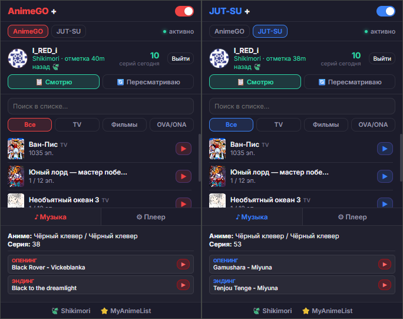
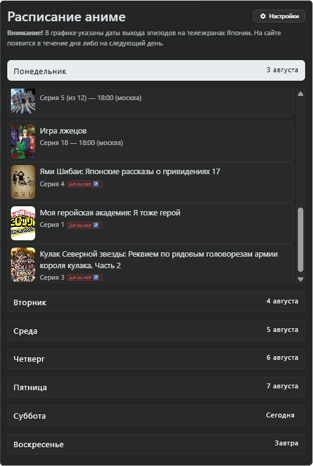
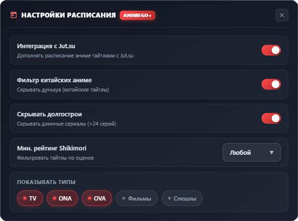
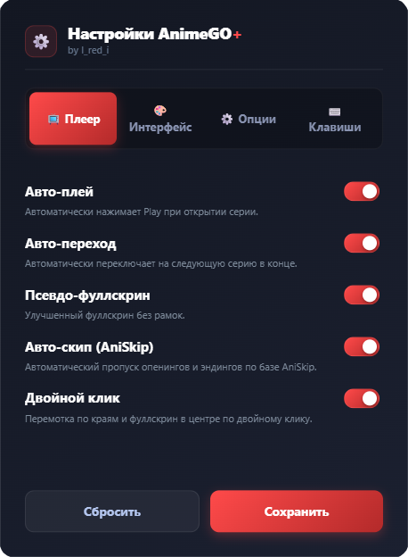
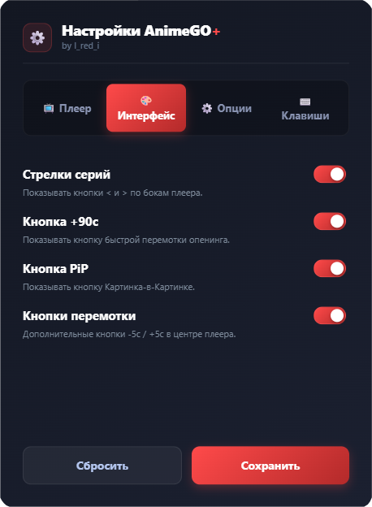
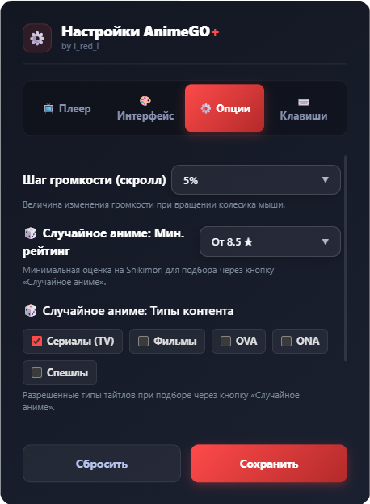
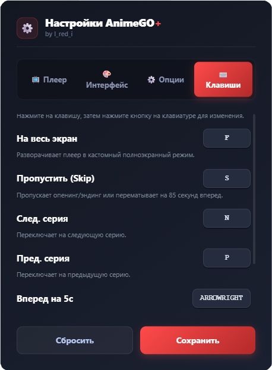

  

<h1 align="center">Anime+</h1>

  <b>Ультимативный аниме-комбайн для AnimeGO и jut-su.net нового поколения.</b>

  
  
  

  
  
  
  

  <a href="#-возможности">Возможности</a> •
  <a href="#-интеграция-shikimori">Shikimori</a> •
  <a href="#-галерея-и-интерфейс">Интерфейс</a> •
  <a href="#-быстрая-установка">Установка</a> •
  <a href="#️-управление">Управление</a>

---

## 🔥 Обзор проекта

**Anime+** — это мощное браузерное расширение, расширяющее возможности просмотра аниме на AnimeGO и jut-su.net. Проект объединяет функционал главных аниме-порталов, интегрирует базу **Shikimori**, умный мульти-поиск и синтетические карточки, предлагая современный **Glassmorphic** интерфейс, который **автоматически подстраивает свой стиль под активный сайт**.

---

## ✨ Возможности

| Функция | Описание |
| :--- | :--- |
| **🎙️ Умный автовыбор озвучки** | Автоматическое переключение на любимую озвучку (AniLibria, Studio Band, Dream Cast и др.) на AnimeGO, Jut-Su и Kodik. |
| **🎨 Автоадаптивный UI** | Дизайн расширения автоматически подстраивается под визуальный стиль AnimeGO, jut-su.net и Shikimori. |
| **⚙️ Единое меню настроек** | 5 полноценных разделов (*Плеер, Озвучка, Интерфейс, Опции, Клавиши*) с настраиваемым списком приоритетов озвучек. |
| **🌐 Мульти-кнопка по запросу** | Интеграция кнопки `▶ Смотреть с Anime+` на Shikimori с авто-поиском и выбором ресурсов (`AnimeGO` / `JUT-SU`). |
| **🔍 Поиск и фильтры в Popup** | Поиск по списку Shikimori и категории типов (`TV`, `Фильмы`, `OVA/ONA`) прямо во всплывающем окне. |
| **🍃 Авто-синхронизация Shikimori** | Синхронизация с аккаунтом Shikimori — отметка просмотренных серий и обновление статусов просмотра. |
| **🗓️ Интеграция jut-su.net в Расписание** | Расписание онгоингов AnimeGO дополняется тайтлами с jut-su.net с удобными настройками. |
| **🎲 Ультимативный Рандомайзер** | Мгновенный подбор случайного аниме с фильтрацией по типам и рейтингу. |
| **🎬 Бесшовный Фолбэк** | Быстрый переход к просмотру тайтла на jut-su.net при его отсутствии на основной площадке. |
| **⭐ Интеграция Рейтингов** | Оценки и виджет Shikimori прямо на страницах тайтлов. |
| **🏛️ Shikimori Engine** | Авто-генерация полноценных синтетических карточек для аниме, отсутствующих в каталоге сайта. |
| **🏆 Топ-100 Shikimori** | Быстрый доступ к топу лучших аниме прямо из шапки сайта. |
| **🎵 Music Finder** | Распознавание опенингов и эндингов с прямыми ссылками на YouTube. |
| **⚙️ Глубокая Настройка** | Кастомизация интерфейса, расписания и горячих клавиш в премиальном модальном окне. |

---

## 🍃 Интеграция Shikimori

Войдите в свой аккаунт **Shikimori** прямо из попап-меню расширения:

- Автоматическое определение текущего аниме и номера серии на **AnimeGO** и **jut-su.net**
- Автоматическое обновление прогресса просмотра в профиле Shikimori
- Авто-смена статуса на **«Пересматриваю»** для ранее завершённых тайтлов
- Бесшовная фоновая работа без отвлечения от просмотра

---

## 📸 Галерея и интерфейс

<b>📱 Главное окно расширения (Pop-up)</b>

 

  

<i>Эстетичный Glassmorphic-интерфейс с быстрыми переключателями и распознаванием музыки.</i>

 

<b>🗓️ Умное Расписание и Интеграция jut-su.net</b>

 

| 🗓️ Виджет расписания | ⚙️ Настройки расписания |
| :---: | :---: |
|  |  |

<i>Дополнение списка онгоингами с jut-su.net, фильтрация дуньхуа и длинных тайтлов.</i>

 

<b>⚙️ Панель настроек расширения</b>

 

| 📺 Плеер | 🎨 Интерфейс |
| :---: | :---: |
|  |  |

| ⚙️ Опции | ⌨️ Клавиши |
| :---: | :---: |
|  |  |

---

## 🚀 Быстрая установка

### Способ 1: Из Chrome Web Store (Рекомендуется)

Просто перейдите на [страничку расширения в Chrome Web Store](https://chromewebstore.google.com/detail/anime+/mgcaideibpbdddnbedoefmabladoaajg?hl=ru) и нажмите кнопку **«Установить»**.

### Способ 2: Установка из исходного кода (для разработчиков)

1. **Скачайте исходный код:** Нажмите **`Code` ➔ `Download ZIP`** в верхней части страницы и распакуйте архив.
2. **Откройте расширения:** Перейдите в браузере по адресу `chrome://extensions/`.
3. **Режим разработчика:** Включите тумблер **«Режим разработчика»** (*Developer mode*) в правом верхнем углу.
4. **Загрузка:** Нажмите **«Загрузить распакованное расширение»** (*Load unpacked*) и укажите папку с проектом.
5. **Готово:** Открывайте [AnimeGO](https://animego.org) или [jut-su.net](https://jut-su.net) и наслаждайтесь! 🍿🔥

---

## ⌨️ Управление

Управляйте просмотром с клавиатуры.

| Клавиша | Действие |
| :---: | :--- |
| <kbd>Esc</kbd> / <kbd>F</kbd> | **Псевдо-Fullscreen** — разворачивает плеер на весь экран браузера. |
| <kbd>S</kbd> | **Умный пропуск** — пропуск опенинга/эндинга или перемотка на 85 секунд. |
| <kbd>N</kbd> | Переход на **следующую** серию. |
| <kbd>P</kbd> | Переход на **предыдущую** серию. |
| <kbd>↑</kbd> / <kbd>↓</kbd> | Точная регулировка **громкости**. |
| <kbd>Скролл</kbd> | Регулировка **громкости** колесиком мыши над плеером. |

*Все клавиши можно перенастроить в меню расширения.*

---

## 👨‍💻 Автор и комьюнити

  

  <b>Создано с ❤️ разработчиком <a href="https://github.com/lredi1337">l_red_i</a> специально для аниме-сообщества.</b>

